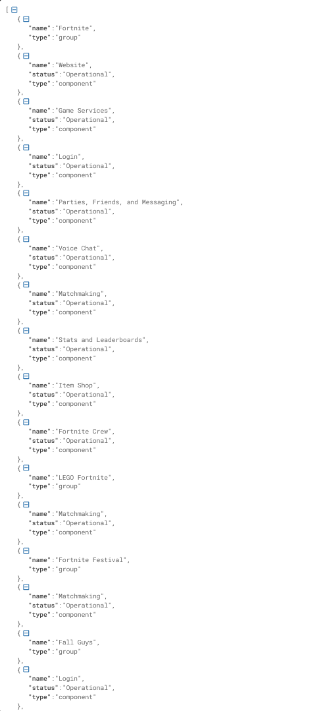

# Epic Games Status Checker (Unofficial)

**Born from a parent's frustration**

When my kid couldn't log in to Epic Games and was getting upset, I wanted to quickly check the server status. Epic has a status page, but no readily available API. So, in a moment of parental ingenuity, I whipped up this simple scraper. Now it provides a basic endpoint you can use to build your own bot or notification system!

## Disclaimer

* This is **NOT** an official Epic Games project.
* It's a quick and dirty solution, so there's no guarantee it will work forever if Epic changes their website structure.
* Use at your own risk!

## How it works

1. **Scrapes the Epic Games status page:** The code periodically fetches the official status page and parses the HTML.
2. **Provides a simple API:**  A `/epic-games-status` endpoint returns the current status of various Epic services in JSON format.

## What you can do with it

* **Build a notification bot:** Get alerted when Fortnite (or other Epic services) go down.
* **Integrate with your own project:** Display the status information in your own application.
* **Peace of mind:**  Next time your kid is freaking out, you can quickly check if it's an Epic issue or something on their end.

## Setup

1. **Clone the repository:** `git clone [repository URL]`
2. **Install dependencies:** `pip install -r requirements.txt` (You'll need Flask, requests, and BeautifulSoup4)
3. **Run the script:** `python your_script_name.py`

## API Endpoint

* **URL:** `/epic-games-status`
* **Method:** GET
* **Response:** JSON array containing status information for various Epic services and components.

## Contributing

Feel free to fork and improve!  Pull requests are welcome. 

## License

This project is released under the MIT License.

**Remember:** This was a spur-of-the-moment project born out of a need. It's not perfect, but hopefully it helps someone else out there facing the same frustrated-kid scenario!

